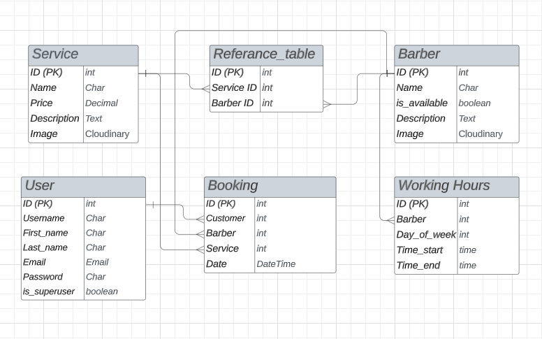
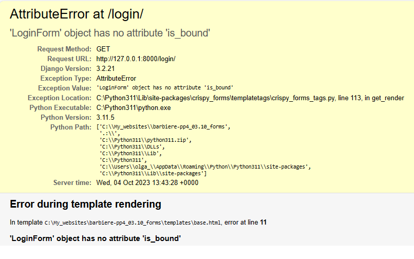
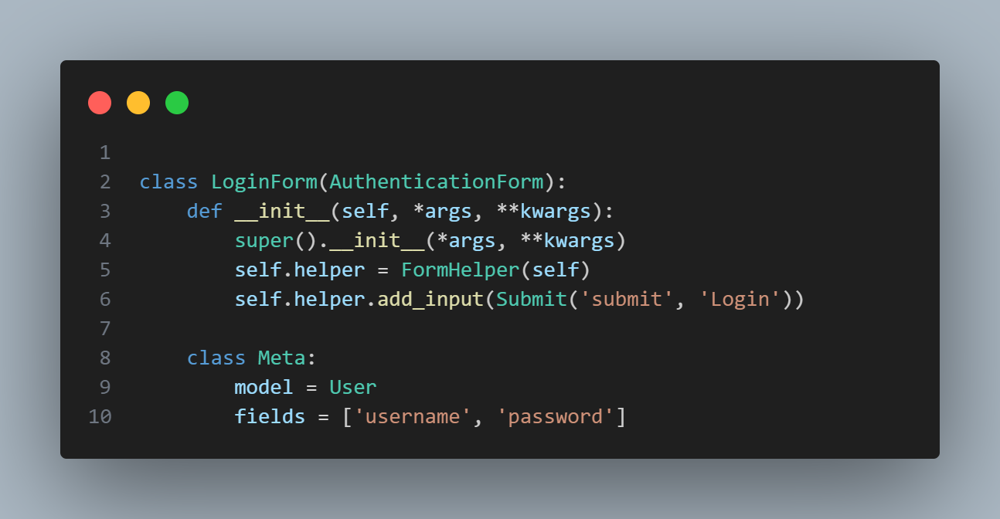
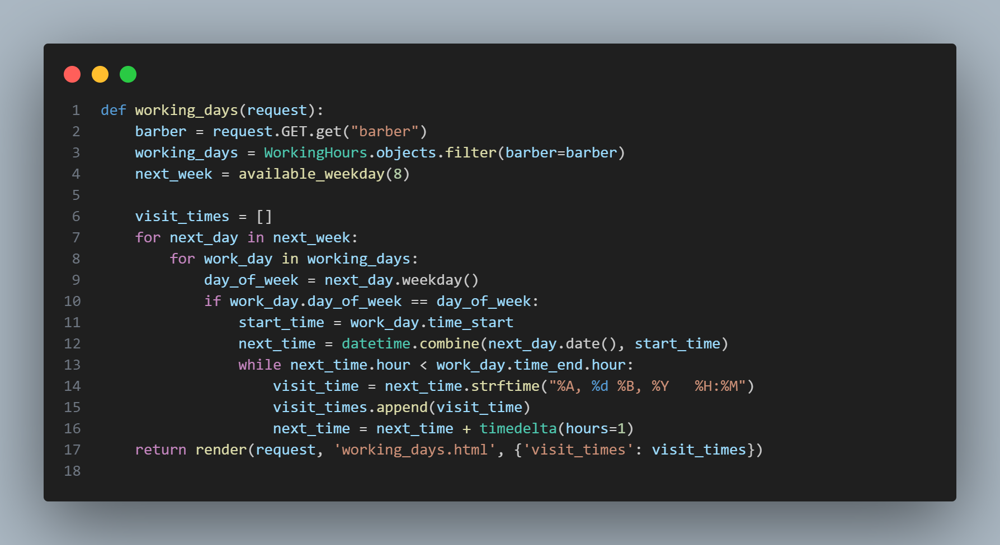
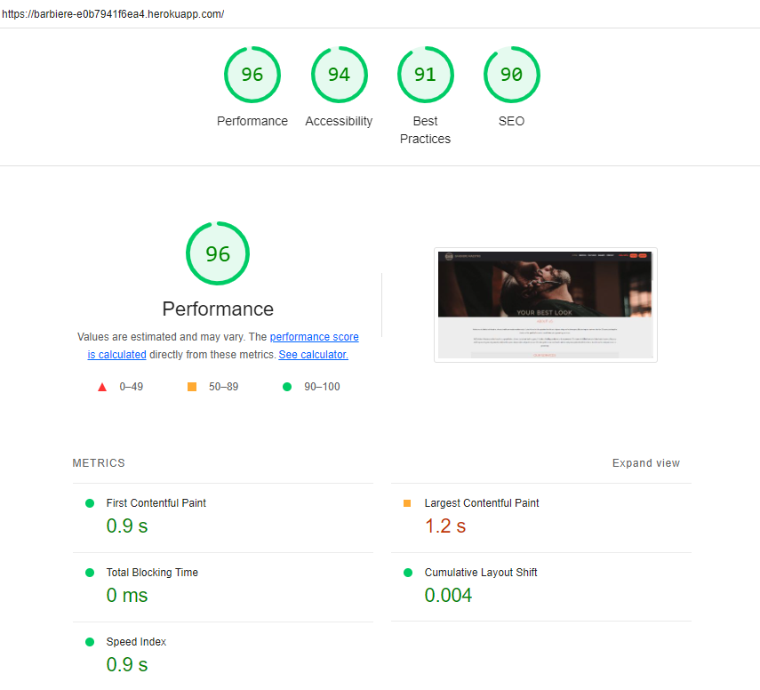
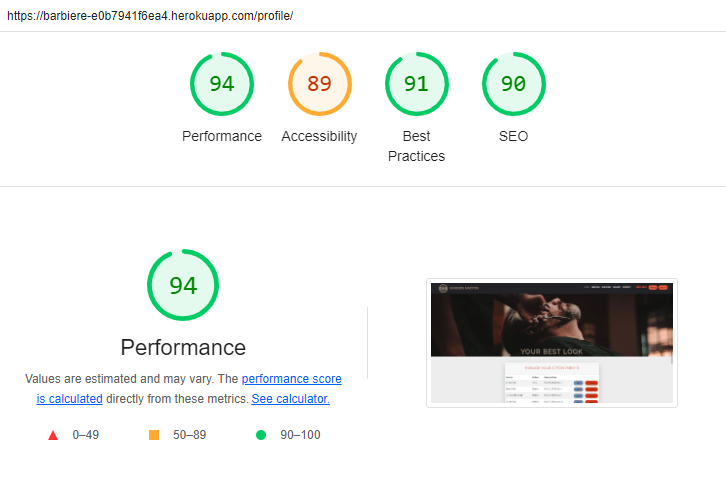
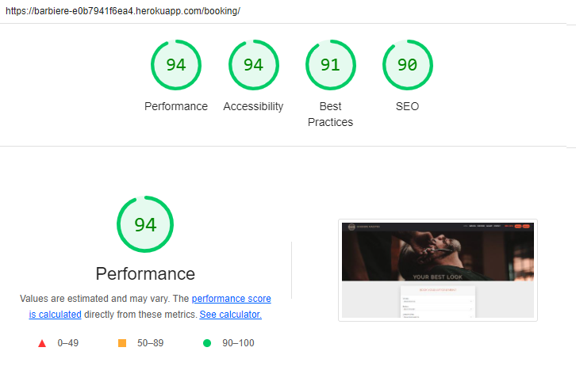
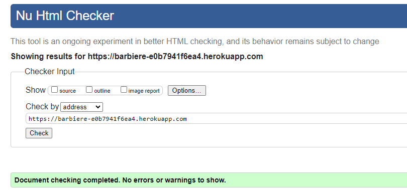
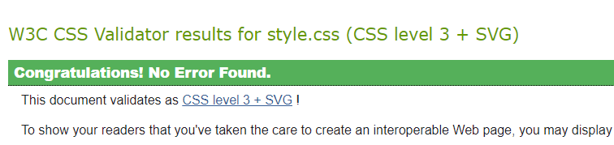
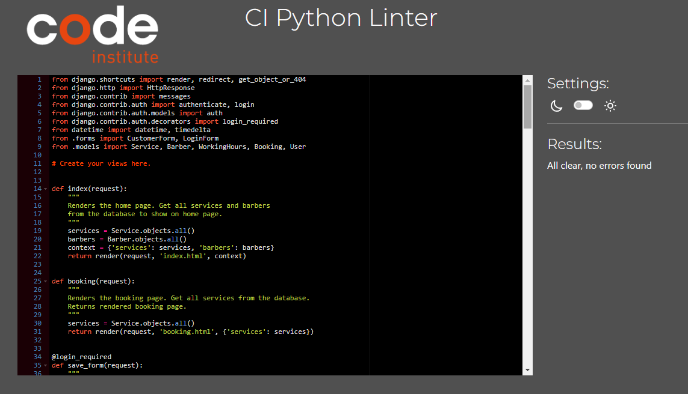

# 
Barbiere Maestro

### [Live site](https://barbiere-e0b7941f6ea4.herokuapp.com/)

## Contents:

- <a href="#ux">UX</a>
  - <a href="#strategy">Strategy</a>
  - <a href="#db">Database structure</a>
  - <a href="#design">Design</a>
- <a href="#testing">Testing</a>
  - <a href="#testing_us">Testing User Stories</a>
  - <a href="#testing_features">Testing Features</a>

## 
UX

### Overview
Barbiere Maestro is a website for a modern barbershop salon. The main goal is to create a simple and intuitive website based on a deep understanding of the target users. The landing page provides all the key information a potential customer needs to know, including services and pricing. The Gallery introduces visitors to available options and helps improve the customer experience. Users of the site can obtain detailed information about the services provided, about the experience of each barber, and also look at examples of barber's haircuts in photo gallery to decide whether they want to use the services of this salon.

#### First Time User
- As a person who lives near a barbershop and looking for good barber service.
- As a person who is looking for clear information about the barbershop and services provided.
- As a person who prefer to make bookings digitally rather than speaking with others.

#### Returning User
- As a returning user, I would like to review all my previous barbershop appointments.
- As a returning user, who already has an account I would like quickly and easily make an appointment with a barber.
- As a returning user, I would like to see updates to the information on the site so that I can find something new and interesting for myself (for example, new modern haircuts).

### 
Strategy

Determining the best approach meant studying the needs of potential users. This included users logging in, quickly and easily booking appointments, reading, updating and deleting their appointments (CRUD). 
One of the main features of this website is the ability for the registered user to fill out and submit the booking form without refreshing the page. The form contains 3 dependent dropdown lists where the user can select the service he needs, the barber and the date and time of appointment.

#### Agile
The Agile methodology was used to plan the project. Github was used as the tool to demonstrate this. Milestones were used to create Epics. Each user story was linked to an Epic and placed within one of three Iterations. Issues were used to create User Stories with a custom templates ([Link to Kanban board](https://github.com/users/OlgaKuvs/projects/3/views/1)). 
To prioritize tasks [MoSCoW method](https://github.com/users/OlgaKuvs/projects/3/views/4) was used.

##### User Stories 
Issues were used to create User Stories with a custom templates for admin and user. I added the acceptance criteria and the tasks so I can track my work effectively. Once I completed a User Story I would move it from in progress to completed. 

- Completed User Stories: 

  - Epic: Enable users to CRUD the bookings. 

    - As a Registered User I would like to see a list of available services, including relevant details such as barber name, appointment date and time so that I can choose the options that suit me.
    - As a Registered User I would like to view my appointments so that I can keep track of my booking (CRUD).
     - As a Registered User I would like to edit my booking so that I can change the details (CRUD).
    - As a Registered User I would like to delete my booking so that I can cancel my appointment (CRUD). 

  - Epic: Enable unregistered users to view all the key information about the barbershop. 

    - As a User I would like to examine the information on the home page about the services provided so that decide whether I want to use them. 

  - Epic: Enable users to create an account and log in. 

    - As a User I would like to create an account so that I can book an appointment.
    - As a User, I would like to log in, so that I can access my profile. 

  - Epic: Set up admin page for admin (superuser) to manage barbershop's work. 
    - As an admin I would like to have an access to database data so that I can make necessary changes (CRUD).
    - As an Admin I would like to view the bookings so that I can manage the barber's timetable. 

- Uncompleted User Stories: 

    The following User stories were not completed (marked as `Could have` in MoSCoW method table) as they were deemed to be not necessary for this project at this time but are indications of possible future features:  

    - As a Registered User, I want to receive a confirmation text message or email, so that I know my appointment has been successfully booked.
    - As a Registered User I would like to be able to make an appointment with any barber to get the opportunity to choose a wider range of dates and times. 

  ---

### 
Database structure

When I decided on my initial concept of this project I knew I needed to understand what type of data I would need to store and the relationships between them. I created a Database Schema to help guide me.

The pre-planned database structure underwent a number of changes during the work on the project, in particular, `description` and `image` fields were added to `Service` and `Barber` models, and the service duration field was removed as unnecessary. 

### 
Design

The site design is intuitive and functional. Google fonts Lato (body) and Raleway (headers) have been used to customize the default Bootstrap fonts. Sans Serif was chosen as the backup font. 
The main goal of the site is to provide users with practical and useful information about the barbershop and functionality for making an appointment, and in this context, purposeful efforts have been made, as well as focus on the views required by users.

#### Colours

The following colour palette was used from [Coolors](https://coolors.co/):

The colours are chosen to convey male masculinity and brutality. The color `Tomato` for the buttons was chosen to attract attention and contrast with the rest of the colors in the design.
<a href="#up">Back to Top of page</a>

---

## 
Testing

### Manual testing

#### 
Testing User Stories 

| User story        | User story testing |           
| ------------------ | ------------- | 
| As a User I would like to examine the information on the home page about the services provided so that decide whether I want to use them. | On the home page user can view complete information about the barbershop, services with descriptions and prices, information about each barber including his name and work experience. Also user can view the pictures of various haircuts as work examples and choose the haircut that he likes.
| As a User I would like to create an account so that I can book an appointment. | On registering for the user account, the user populates their own information for log in in the future. User can add their username, first name, last name, e-mail address and password during the registration process (Create). | 
| As a User, I would like to log in, so that I can access my profile. | Once logged in, a registred user can view a list of their appointments on their profile page (Read). If the user does not have an appointment yet they can click the link to make an appointment. | 
| As a Registered User I would like to see a list of available services, including relevant details such as barber name, appointment date and time so that I can choose the options that suit me.| On the booking page, the user can see the booking form with 3 dependent dropdown lists: the list of services, the list of barbers providing the selected service and the list of available dates and times for the selected barber. And they can choose from the lists what suits them. |
|As a Registered User I would like to view my appointments so that I can keep track of my booking.| On the profile page user can view all details of their bookings including service name, barbers name and date and time of appointment. From this view they have acccess to every booking update (`Update` button) or delete (`Delete` button).  |
| As a Registered User I would like to edit my booking so that I can change the details. | On the profile page, the user can click the "Edit" button for each of their appointments and is redirected to the update page. On the update page they can see all the details of the current booking and below the form for making changes. After making the necessary changes, the user can click "Change" button and is redirected to the profile page, where all changes made are reflected. Or the user can click the "Cancel" button to be redirected to the profile page without making any changes.| 
| As a Registered User I would like to delete my booking so that I can cancel my appointment. | On the profile page, the user can click the "Delete" button for each of their appointments and is redirected to the `delete` page. On the `delete`  page they is asked to confirm the deletion. If they click "Yes" button, the appointment is deleted, and they are redirected to the profile page. If they click "Cancel" button, they are redirected to the profile page without making any changes. |
| As an admin I would like to have an access to database data so that I can make necessary changes. | Superuser has been created. All tables are visible and editable from the admin view. |
| As an Admin I would like to view the bookings so that I can manage the barber's timetable. | The Admin has access to booking's data and can determine the workload of each barber. Admin has access to the table with a list of barbers and checks or unchecks the  `is_available` button for each barber to manage the schedule (for example, if the barber is sick or on vacation and is not currently working). |

#### 
Testing Features

##### Navigation links

| Test |  Result |          
| ------------------ | ------------- |
| Non logged in user can access the links of landing page in the navbar.  | Non logged in user can access Home, Services, Our Staff, Gallery and Contact pages. All navigation links on landing page are working and bring the user to the correct part of the page. Active page link is highlighted in each case. Navbar remains in view when scrolling. 
| Non logged in user can go to the home page by clicking the title or logo in the page header. | Links from `Barbiere Maestro` title and logo image allow the user to return to home page from each part of landing page. |
| Non logged in user can access to sign in and login pages.| User can click the `Login` button on the right side of the header and is redirected to the login page. For signing in, there are 2 navigation buttons `Sign up and Book now!` on hero image and in the footer. By clicking these buttons the user is redirected to the sign up page. |
| Logged in user can access to profile page and log out. | Logged in user can view `Profile` and `Logout` buttons on the right side of the page header. Sign up buttons are not visible to the logged in user. |
| Logged in user can view the bookings.| List of bookings is available on user's profile page. User can acccess the profile page by clicking `Profile` button on the navigation bar. |
| Logged in user can log out of their profile.| User can click `Logout` button on the navigation bar and  log out of their profile. |

##### User Forms

| Test |  Result |          
| ------------------ | ------------- |
| User can create account. | User is redirected to the registration page by clicking `Sign up and Book now!` on the homepage. Also user can access registration page from login page. They are asked to register if they don't already have an account. The registration form has error handling built in so the user must make the correct inputs. If inputs are incorrect the user is shown a message about incorrect data entry. If registration is successful, a message `Your account is created successfully` is displayed to the user. |
| User can log in. | User is redirected to the login page by clicking `Login` button. Also user can access login page from registration page. They are asked to log in if they have an account. After authorization the message `You are successfully logged in` is displayed. If the username or password is incorrect, the message `Username or password is wrong! Try again...` is displayed to the user. |
| Logged in user can make a booking. | Logged in user can access booking page from `Our staff` part of landing page by clicking `Book now` button, and also from user profile page by clicking  `Book an appointment`. Then user is redirected to the booking page. On the booking page, the user can fill out a form by selecting services from the list, barbers from the list, choose the date and time of the appointment, and then click `Book` button. User can make a booking only after the values ​​in all dropdown lists have been selected. User is redirected to the profile page to view the list of their appointments. |
| Autoreset booking form fields. | On changing the selected value of `Services` field, the values ​​of `Barbers` and `Dates and times` fields are automatically reset. On changing the selected value of `Barbers` field, the value ​​of `Dates and times` field is automatically reset. |
| Logged in user can update the bookings.| Each booking in the bookings list has an `Update` button. On clicking `Update` the user is redirected to update page. Full details of the current booking are displayed on the update page and the user is prompted to change the booking by filling out the booking form below. User can update a booking when all fields complete. Updated booking data and the message `Your appointment is changed` are displayed to the user on profile page. |  

#####  Security Tests

| Test |  Result |          
| ------------------ | ------------- |
|Non logged in user cannot make a booking. | The booking page is available only to authorized users. If non logged in user clicks `Book` button on the landing page an informational message is displayed asking them to log in to make an appointment.  |
|Non logged in user cannot access profile page. | The link to the profile page is visible only to authorized users.|
|User cannot delete a booking without confirmation. | Each booking in the bookings list has an `Delete` button. On clicking `Delete` the user is redirected to delete page and is asked to confirm that they want to cancel the appointment. Сlicking `Yes` deletes the booking. The profile page displays updated booking details and the message `Your booking has been cancelled`.
| Non superuser cannot access admin panel. | The admin panel is accessible only to the user with a superuser login and password. |

##### Admin Tests

| Test |  Result |          
| ------------------ | ------------- |
|Admin can view data in database tables. | Admin (superuser) can view all data from database tables including ManyToManyField data. To display ManyToManyField data in `list_display` field, a custom method was added to the class `BarberAdmin`. |
|Admin can add items to the following tables: Services, Barbers, Working Hours, Bookings and Users| Admin can access to all database tables and can add items to them.  |
|Admin can edit items in database. | Admin can access all fields in the database tables and make any changes. |
|Admin can search and filter data in database tables.  | Admin can search and filter data in database tables using custom fields specified in the corresponding classes. |
|Admin can delete items in database. | Admin can access all fields in the database tables and can delete a model instance. Any objects which had foreign keys pointing at the object to be deleted will be deleted along with it.
|Admin can manage the barber's availability. | Admin can check or uncheck `is_available` flag for each barber changing the work schedule in case the barber is sick, goes on vacation, or is absent for some other reason. Unchecked `is_available` flag means that the barber is not available for booking.

##### Booking Tests

| Test |  Result |          
| ------------------ | ------------- |
|The list of barbers is loaded correctly depending on the selected service. | Each barber provides specific services. When a specific service is selected, only those barbers who provide this service are loaded into the dropdown list of barbers. |
|Dates and times are loaded correctly depending on the selected barber. |Each barber has his own working days of the week, and times. When a barber is selected, the date and time dropdown list only contains dates in the next 7 days (starting from tomorrow) that correspond to working weekdays for the given barber, and only those time slots that are available at these days for given barber (time slots have 1 hour intervals). Previously booked time slots are not displayed. | 
|Admin can manage the availability of barbers.|If a barber has been marked as unavailable by the admin in the django admin panel, barber's name is not shown in the corresponding dropdown list.|

<a href="#up">Back to Top of page</a>

---

### Bugs

##### LoginForm bug

- When processing data from the user login form, the following error occurred:

- After setting up the `LoginForm` correctly, the error was fixed: 

##### DateTime bug

- When iterating through DateTime and Time objects a number of errors occurred due to format mismatches. Function `available_weekday(days)` returned dates in the DateTime format, and from this data I needed to get the day of the week (since the database indicates the days of the week on which a particular barber works). And then I needed to create time slots to display them in the booking form. To combine the date and time, the function `datetime.combine()` was used.

##### Background images bug

Once I deployed the project to heroku, the background images (hero image and footer background image) were not loading from cloudinary. 
I tried various solutions to the problem, and in the end I added the direct URL to the images to my `style.css` file. Once I reloaded the static and pushed to github, my heroku app reloaded, deployed and was working.

### Google Lighthouse Testing
#### Desktop

> Homepage (index.html)

> profile.html

> booking.html

### HTML W3 Validation

Result: no errors or warnings.

### CSS Validation

Result: no errors.

### Python Validation
> views.py

Result: no errors.
