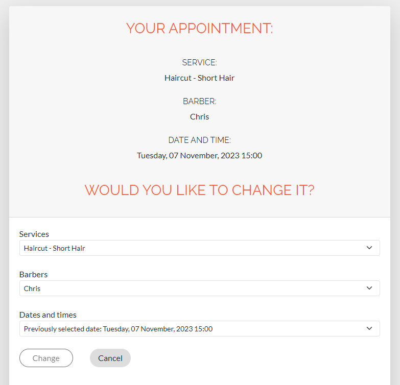
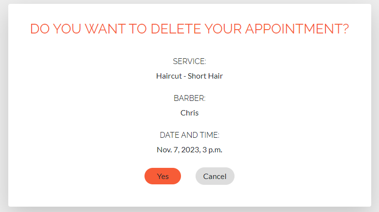

# 
Barbiere Maestro

### [Live site](https://barbiere-e0b7941f6ea4.herokuapp.com/)

## Contents:

- <a href="#ux">UX</a>
  - <a href="#strategy">Strategy</a>
  - <a href="#db">Database structure</a>
  - <a href="#design">Design</a>
- <a href="#testing">Testing</a>
- <a href="#bugs">Bugs</a>
- <a href="#features">Existing Features</a>
- <a href="#f_features">Features left to Implement</a>
- <a href="#technology">Languages, Technologies & Libraries</a>
- <a href="#credits">Credits</a>
- <a href="#deployment">Deployment</a>
- <a href="#acknowledgements">Acknowledgements</a>

## 
UX

### Overview
Barbiere Maestro is a website for a modern barbershop salon. The main goal is to create a simple and intuitive website based on a deep understanding of the target users. The landing page provides all the key information that potential customer needs to know, including services and pricing. The Gallery introduces visitors to available options and helps to improve the customer experience. Users of the site can view each barber's profile, where their previous experiance and work listed, they can also browse through recent photo gallery and price list to decide whether they want to use the services of the salon.

#### First Time User
- As a person who lives near the barbershop and looking for good barber service.
- As a person who is looking for clear information about the barbershop and services provided.
- As a person who prefers to make bookings digitally rather than speaking with others.

#### Returning User
- As a returning user, I would like to review all my previous barbershop appointments.
- As a returning user, who already has an account I would like quickly and easily make an appointment with a particular barber.
- As a returning user, I would like to see updates to the information on the site so that I can find something new and interesting for myself (for example, new modern haircuts).

### 
Strategy

Determining the best approach meant studying the needs of potential users. This included users logging in, quickly and easily booking appointments, reading, updating and deleting their appointments (CRUD). 
One of the main features of this website is the ability for the registered user to fill out and submit the booking form without refreshing the page. The form contains 3 dependent dropdown lists where the user can select the service they need, the barber and the date and time of appointment.

#### Agile
The Agile methodology was used to plan the project. Github was used as the tool to demonstrate this. Milestones were used to create Epics. Each user story was linked to an Epic and placed within one of three Iterations. Issues were used to create User Stories with custom templates ([Link to Kanban board](https://github.com/users/OlgaKuvs/projects/3/views/1)). 
To prioritize tasks [MoSCoW method](https://github.com/users/OlgaKuvs/projects/3/views/4) was used.

##### User Stories 
Issues were used to create User Stories with custom templates for admin and user. I added the acceptance criteria and the tasks so I can track my work effectively. Once I completed a User Story I would move it from `in progress` to `completed`. 

- Completed User Stories: 

  - Epic: Enable users to CRUD the bookings. 

    - As a Registered User I would like to see a list of available services, including relevant details such as barber name, appointment date and time so that I can choose the options that suit me.
    - As a Registered User I would like to view my appointments so that I can keep track of my booking (CRUD).
     - As a Registered User I would like to edit my booking so that I can change the details (CRUD).
    - As a Registered User I would like to delete my booking so that I can cancel my appointment (CRUD). 

  - Epic: Enable unregistered users to view all the key information about the barbershop. 

    - As a User I would like to examine the information on the home page about the services provided so that decide whether I want to use them. 

  - Epic: Enable users to create an account and log in. 

    - As a User I would like to create an account so that I can book an appointment.
    - As a User, I would like to log in, so that I can access my profile. 

  - Epic: Set up admin page for admin (superuser) to manage barbershop's work. 
    - As an admin I would like to have an access to database data so that I can make necessary changes (CRUD).
    - As an Admin I would like to view the bookings so that I can manage the barber's timetable. 

- Uncompleted User Stories: 

    The following User Stories were not completed (marked as `Could have` in MoSCoW method table) as they were deemed to be not necessary for this project at this time but are indications of possible future features:  

    - As a Registered User, I want to receive a confirmation text message or email, so that I know my appointment has been successfully booked.
    - As a Registered User I would like to be able to make an appointment with any barber to get the opportunity to choose a wider range of dates and times. 

  ---

### 
Database structure

When I decided on my initial concept of this project I knew I needed to understand what type of data I would need to store and the relationships between them. I created a Database Schema to help guide me.

The pre-planned database structure underwent a number of changes during the work on the project, in particular, `description` and `image` fields were added to `Service` and `Barber` models, and the service duration field was removed as unnecessary. 

### 
Design

The site design is intuitive and functional. Google fonts Lato (body) and Raleway (headers) have been used to customize the default Bootstrap fonts. Sans Serif was chosen as the backup font. 
The main goal of the site is to provide users with practical and useful information about the barbershop and functionality for making an appointment, and in this context, purposeful efforts have been made, as well as focus on the views required by users.

#### Colours

The following colour palette was used from [Coolors](https://coolors.co/):

The colours are chosen to convey male courage, masculinity and brutality. The colour `Tomato` for the buttons was chosen to attract attention and contrast with the rest of the colours in the design.

#### Wireframes

> index.html

> booking.html

<a href="#up">Back to Top of page</a>

---

## 
Testing

### Manual testing

Thorough testing was conducted by the developer and multiple users among friends and family. Usability suggestions were considered and acted on.
All design features have been manually tested and everything functions as expected. Testing was completed in my local terminal and also in Heroku deployment.

- Testing for responsiveness was conducted using Chrome Dev Tools. The website was tested extensively on a range of emulated mobile, tablet and large format screen sizes in both portrait and landscape orientations.<a href="#responsiveness">(Testing results are here)</a>

- All HTML files were passed through the W3C validator with no errors.
- CSS file (`style.css`) was passed through the W3C validator with no errors.
- The website was tested on browsers Chrome, Firefox, Edge and Opera.
- All user flows were tested, including landing page navigation, link clicks and forms submissions.
- All forms have been tested to ensure they are validated and can be submitted without errors.

The steps and results are as follows.

#### 
Testing User Stories 

| User story        | User story testing |           
| ------------------ | ------------- | 
| As a User I would like to examine the information on the home page about the services provided so that I can decide whether I want to use them. | On the home page user can view complete information about the barbershop, services with descriptions and prices, information about each barber including their name and work experience. Also user can view the pictures of various haircuts as work examples and choose the hairstyle that he likes.
| As a User I would like to create an account so that I can book an appointment. | After registering the account, the user populates their own information for log in in the future. User can add their username, first name, last name, e-mail address and password during the registration process (Create). | 
| As a User, I would like to log in, so that I can access my profile. | Once logged in, a registred user can view a list of their appointments on their profile page (Read). If the user does not have an appointment yet they are redirected to the booking page. | 
| As a Registered User I would like to see a list of available services, including relevant details such as barber name, appointment date and time so that I can choose the options that suit me.| On the booking page, the user can see the booking form with 3 dependent dropdown lists: the list of services, the list of barbers providing the selected service and the list of available dates and times for the selected barber. They can choose from the lists what suitable for them. |
|As a Registered User I would like to view my appointments so that I can keep track of my booking.| On the profile page user can view all details of their bookings including service name, barbers name and date and time of appointment. From this view they have access to every scheduled (12 hours ahead and more) booking which can be updated (`Update` button) or deleted (`Delete` button).  |
| As a Registered User I would like to edit my booking so that I can change the details. | On the profile page, the user can click the "Edit" button for each of their appointments and is redirected to the `update` page. On the `update` page they can see all the details of the current booking and below the form for making changes. After making the necessary changes, the user can click `Change` button and is redirected to the profile page, where all changes are reflected. Or the user can click the `Cancel` button to be redirected to the profile page without making any changes.| 
| As a Registered User I would like to delete my booking so that I can cancel my appointment. | On the profile page, the user can click the `Delete` button for each of their appointments and is redirected to the `delete` page. On the `delete`  page they are asked to confirm the deletion. If they click "Yes" button, the appointment is deleted, and they are redirected to the profile page. If they click `Cancel` button, they are redirected to the profile page without deleting the appointment. |
| As an admin I would like to have an access to database content so that I can make necessary changes. | Superuser has been created. All tables are visible and editable from the admin view. |
| As an Admin I would like to view the bookings so that I can manage the barber's timetable. | The Admin has access to booking's data and can determine the workload of each barber. Admin has access to the table with a list of barbers and checks or unchecks the  `is_available` button for each barber to manage the rota (for example, if the barber is sick or on holidays and is not currently working). |

#### 
Testing Features

##### Navigation links

| Test |  Result |          
| ------------------ | ------------- |
| Non logged in user can access the links of landing page in the navbar.  | Non logged in user can access Home, Services, Our Staff, Gallery and Contact sections. All navigation links on landing page are working and bring the user to the correct part of the page. Active page link is highlighted in each case. Navbar remains in view when scrolling. 
| Non logged in user can go to the home page by clicking the title or logo in the page header. | Links from `Barbiere Maestro` title and logo image allow the user to return to home page from each part of landing page. |
| Non logged in user can access to sign in and login pages.| User can click the `Login` button on the right side of the header and is redirected to the login page. For signing in, there are 2 navigation buttons `Book now!` in the header and in the footer. By clicking these buttons the user is redirected to the sign in page. |
| Logged in user can access to profile page and log out. | Logged in user can view `Profile` and `Logout` buttons on the right side of the page header. `Book now!` buttons (header and footer) are not visible to the logged in user. |
| Logged in user can view the bookings.| List of bookings is available on user's profile page. If the user already has appointments assigned, they are redirected from the `Login` page to the `Profile` page to view current bookings. If the user does not have a reservation yet, they are redirected to the `booking` page. User can acccess the profile page by clicking `Profile` button on the navigation bar.  |
| Logged in user can log out of their profile.| User can click `Logout` button on the navigation bar and  log out of their profile. |

##### User Forms

| Test |  Result |          
| ------------------ | ------------- |
| User can create account. | User is redirected to the registration page by clicking `Book now!` on the homepage. Also user can access registration page from `login` page. They are asked to register if they don't already have an account. The registration form has error handling built in so the user must make the correct inputs. If inputs are incorrect the user is shown a message about incorrect data entry. If registration is successful, a message `Your account is created successfully` is displayed to the user. |
| User can log in. | User is redirected to the login page by clicking `Login` button. Also user can access login page from registration page. They are asked to log in if they have an account. After authorization the message `You are successfully logged in` is displayed. If the username or password is incorrect, the message `Username or password is wrong! Try again...` is displayed to the user. |
| Logged in user can make a booking. | Logged in user can access booking page from user profile page by clicking  `Book an appointment`. Then user is redirected to the booking page. On the booking page, the user can fill out a form by selecting services from the list, barbers, also choose the date and time of the appointment, and then click `Book` button. User can make a booking only after the values ​​in all dropdown lists have been selected. User is redirected to the profile page to view the list of their appointments. |
| Autoreset booking form fields. | On changing the selected value of `Services` field, the values ​​of `Barbers` and `Dates and times` fields are automatically reset. On changing the selected value of `Barbers` field, the value ​​of `Dates and times` field is automatically reset. |
| Logged in user can update the bookings.| Each scheduled booking in the bookings list has an `Update` button. On clicking `Update` the user is redirected to update page. Full details of the current booking are displayed on the `update` page and the user is prompted to change the booking by filling out the booking form below. User can update a booking when all fields complete. Updated booking data and the message `Your appointment is changed` are displayed to the user on profile page. |  

#####  Security Tests

| Test |  Result |          
| ------------------ | ------------- |
|Non logged in user cannot make a booking. | The booking page is available only to authorized users. If non logged in user clicks `Book` button on the landing page an informational message is displayed asking them to log in to make an appointment.  |
|Non logged in user cannot access profile page. | The link to the profile page is visible only to authorized users.|
|User cannot delete a booking without confirmation. | Each scheduled booking in the bookings list has an `Delete` button. On clicking `Delete` the user is redirected to `delete` page and is asked to confirm that they want to cancel the appointment. Сlicking `Yes` deletes the booking. The profile page displays updated booking details and the message `Your booking has been cancelled`.
| Non superuser cannot access admin panel. | The admin panel is accessible only to the user with a superuser login and password. |

##### Admin Tests

| Test |  Result |          
| ------------------ | ------------- |
|Admin can view data in database tables. | Admin (superuser) is redirected from the login page to the admin panel. Admin can view all data from database tables including ManyToManyField data. To display ManyToManyField data in `list_display` field, a custom method was added to the class `BarberAdmin`. |
|Admin can add items to the following tables: Services, Barbers, Working Hours, Bookings and Users| Admin can access to all database tables and can add items to them.  |
|Admin can edit items in database. | Admin can access all fields in the database tables and make any changes. |
|Admin can search and filter data in database tables.  | Admin can search and filter data in database tables using custom fields specified in the corresponding classes. |
|Admin can delete items in database. | Admin can access all fields in the database tables and can delete a model instance. Any objects which had foreign keys pointing at the object to be deleted will be deleted along with it.
|Admin can manage the barber's availability. | Admin can check or uncheck `is_available` flag for each barber changing the work schedule in case the barber is sick, goes on holidays, or is absent for any other reason. Unchecked `is_available` flag means that the barber is not available for booking.

##### Booking Tests

| Test |  Result |          
| ------------------ | ------------- |
|The list of barbers is loaded correctly depending on the selected service. | Each barber provides specific services. When a specific service is selected, only those barbers who provide this service are loaded into the dropdown list of barbers. |
|Dates and times are loaded correctly depending on the selected barber. |Each barber has their own working days of the week, and times. When a barber is selected, the date and time dropdown list only contains dates in the next 7 days (starting from tomorrow) that corresponds to working weekdays for the chosen barber, and only those time slots that are available at these particular days for chosen barber (time slots have 1 hour intervals). Previously booked time slots are not displayed. | 
|Admin can manage the availability of barbers.|If a barber has been marked as unavailable by the admin in the django admin panel, barber's name is not shown in the corresponding dropdown list.|

#### 
Responsiveness Testing

Testing for responsiveness was conducted using Chrome Dev Tools. The website was tested extensively on a range of emulated mobile, tablet and large format screen sizes in both portrait and landscape orientations.

| Device |  Resolution  |   Result  |        
| ------------------ | ------------- | ------------- |
| Samsung Galaxy S8+|  360 x 740  |   Pass  |
| iPhone 6/7/8 |  375 x 667  |   Pass  |
| iPhone X |  375 x 812  |   Pass  | 
| iPhone 12 PRO |  390 x 844  |   Pass  |
| Samsung Galaxy A51/71 |  412 x 914  |   Pass  |
| iPhone XR |  414 x 896  |   Pass  | 
| iPad Mini |  768 x 1024  |   Pass  | 
| iPad Air |  820 x 1180  |   Pass  | 
| iPad Pro |  1024 x 1366 |   Pass  | 
| HP Laptop 14s |  1920 x 1080|   Pass  | 

<a href="#up">Back to Top of page</a>

---

### 
Bugs

##### LoginForm bug

- When processing data from the user login form, the following error occurred:

- After setting up the `LoginForm` correctly, the error was fixed: 

##### DateTime bug

- When iterating through DateTime and Time objects a number of errors occurred due to format mismatches. Function `available_weekday(days)` returned dates in the DateTime format, and from this data I needed to get the day of the week (since the database indicates the days of the week on which a particular barber works). And then I needed to create time slots to display them in the booking form. To combine the date and time, the function `datetime.combine()` was used.

##### Background images bug

Once I deployed the project to heroku, the background images (hero image and footer background image) were not loading from cloudinary. 
I have tried different solutions to the problem, and in the end I've added up the direct URL to the images to my `style.css` file. Once I reloaded the static and pushed to github, my heroku app reloaded, deployed and was working correctly.

### Google Lighthouse Testing
#### Desktop

Site pages have been tested using Lighthouse to identify performance and accessibility issues and ensure best practices are followed.

> Homepage (index.html)

> profile.html

> booking.html

### HTML W3 Validation

Result: no errors or warnings.

### CSS Validation

Result: no errors.

### Python Validation

The only issues found in any of the Python files when running through the Pep8CI online validator were due to extra whitespaces and too long lines, and have been fixed.

> views.py

Result: no errors.

### Javascript Validation

JavaScript code passes through [Jslint](jslint.com) with no significant issues.

<a href="#up">Back to Top of page</a>

## 
Existing Features

### Navigation 

The main navigation is located in the header and is present on all pages (fixed at the top). The hamburger menu is present on medium and small devices and expands to show the main navigation links.
The navigation bar contains the site logo, name, landing page navigation links and buttons: `Book now`, `Login/Logout`, `Profile`. 

`Login/Logout`, `Profile` and `Book now` changes dependent on user status.
A welcome message `Hello, <username>!` appears for the logged in user. 

### Landing page

 The landing page sets out all the key information a potential customer will need to know, including services and pricing. A style gallery guides visitors through the options available, leading to improve the customer experience. The page is available to everyone.

### Footer

The footer was designed to provide contact information and opening times. It also contains `Book now` button to go to the authorization section.

### Registration page

The registration form contains the fields needed to create user account. The user also can click the login link to be redirected to the login page. If not all required fields are filled in or are filled in incorrectly, user will receive an error notification.

Once a profile has been created, user will see a message to confirm that the profile has been successfully created.

### Login page

On the login page, the user enters their login and password. The user also has a sign in link in case they don't have an account already. If the details entered are incorrect, they will receive an error notification.

Once logged in, the user will be notified that they are logged in, and redirected to the profile page. 

### Booking page

If the user does not have any appointments yet they are redirected to the booking page.

On the booking page, user can select a service from a dropdown list of services.

Once a service is selected, a list of barbers who provide the selected service appears.

After selecting a barber, a list of available dates and times for that barber appears.

The `Book` button becomes active only after all values ​​in dropdown lists have been selected.

### Profile page

On the profile page user can view all details of their bookings including service name, barber's name and date and time of appointment. From this view they have access to every scheduled (12 hours ahead and more) booking which can be updated (`Update` button) or deleted (`Delete` button). The user profile page shows all bookings that have not been deleted.

### Update page

If the user selects to update a booking they are taken to a form prepopulated with the information about that appointment so it can be edited.

After changing a booking, the user will see a message indicating that the appointment has been changed and will be redirected to the profile page to view the updated information.

### Delete page

If the user decides to delete a booking, they are taken to a deletion confirmation page.

Once an appointment is deleted, the user will see a message:

If the user does not have appointments, they will see a corresponding text.

## 
Features left to Implement

- Create an archive of appointments in the user profile so that the user can track their log of visits to the barbershop.
- Improve the booking form by allowing user to select a date and time of visit separately. 
- Allow the user to select `any barber` option if they do not mind which barber's service to use.
- Add the user's phone number to the booking form so that the salon administrator can call and receive confirmation of attendance for the visit.
- Send the user a confirmation text message or email to let them know their appointment has been successfully booked.
- Improve the user registration form by replacing username with an email address.
- Add beautiful animation to the haircut gallery.

<a href="#up">Back to Top of page</a>

## 
Languages, Technologies & Libraries

### Languages:
- **Python** used for the logic in this project.
- **HTML/CSS** + **Django Template Language** used to structure webpages 
- **Javascript** used to add timeout function for messages and change navigation link style as well as to enable the `Book` button on booking page. 

### Libraries and Frameworks:
- **Django** framework used to build this project. Provides a ready installed admin panel and includes many helper template tags that make writing code quick and efficient.
- **Bootstrap 5** used as the base front end framework to work alongside Django.
- **htmx** library used to fetch and load content dynamically via AJAX requests. Utilised specifically for fetching data from chained dropdown on a booking form.

### Technologies:

- **ElephantSQL** as a PostgreSQL database hosting service used for database.
- **Cloudinary** used to host the static files for this project.
- **Heroku** used for hosting the project.
- **GitHub** used to store the code for this project & for the projects Kanban board used to complete it.

## 
Credits

- [Pexels](https://www.pexels.com/) and [Freepik](https://www.freepik.com/) used for sourcing landing page photographic images.
- [Favicon.io](https://favicon.io/) used to create favicon.
- [favpng](https://favpng.com/) used for service icons templates.
- [Lucidchart](https://www.lucidchart.com/) used to create wireframes and database diagram.
- [Luis Cortes](https://www.youtube.com/watch?v=zYs42XcpHYI) to learn how to create dependent dropdown lists.
- For auto close navbar when click on link (responsive mode): https://stackoverflow.com/questions/66614050/auto-close-navbar-when-click-on-link-responsive-mode
- For Django admin configuration: https://docs.djangoproject.com/en/4.2/ref/contrib/admin/
- For htmx debugging: https://forum.djangoproject.com/t/django-htmx-trigger-upon-change-throws-error/18363/12

<a href="#up">Back to Top of page</a>

## 
Deployment

To deploy the project through Heroku I followed these steps:
  1. Sign up / Log in to Heroku
  2. From the main Heroku Dashboard page select 'New' and then 'Create New App'
  3. Give the project a name and selected EU as that is the closes region to me. After this you select select create app.
  4. The name for the app must be unique or you will not be able to continue. Heroku will create the app and bring you to the deploy tab.
  5. From the submenu at the top, navigate to the resources tab.
  6. Add the database to the app, in the add-ons section search for 'Heroku Postgres', select the package that appears and add 'Heroku Postgres' as the database. 
  7. Click on the setting tab. 
  8. Open the config vars section copy the DATABASE_URL to the clipboard for use in the Django configuration.
  9. Inside the Django app repository create a new file called env.py
  10. Within this file import the os library and set the environment variable for the DATABASE_URL pasting in the address copied from Heroku.
  11. The line should appear as os.environ["DATABASE_URL"]= "Paste the link in here"
  12. Add a secret key to the app using os.environ["SECRET_KEY"] = "your secret key goes here"
  13. Add the secret key just created to the Heroku Config Vars as SECRET_KEY for the KEY value and the secret key value you created as the VALUE
  14. In the settings.py file within the django app, import Path from pathlib, import os and import dj_database_url. Insert the line if os.path.isfile("env.py"): import env
  15. Remove the insecure secret key that django has in the settings file by default and replace it with SECRET_KEY = os.environ.get('SECRET_KEY')
  16. Replace the databases section with DATABASES = { 'default': dj_database_url.parse(os.environ.get("DATABASE_URL"))} ensure the correct indentation for python is used.
  17. In the terminal migrate the models over to the new database connection.
  18. Navigate in a browser to cloudinary, log in, or create an account and log in.
  19. From the dashboard copy the CLOUDINARY_URL to the clipboard
  20. In the env.py file  add os.environ["CLOUDINARY_URL"] = "paste in the Url copied to the clipboard here"
  21. In Heroku, add the CLOUDINARY_URL and value copied to the clipboard to the config vars
  22. Also add the KEY - DISABLE_COLLECTSTATIC with the Value - 1 to the config vars. 
This key value pair must be removed prior to final deployment.
  23. Add the cloudinary libraries to the list of installed apps, the order they are inserted is important, 'cloudinary_storage' goes above 'django.contrib.staitcfiles' and 'cloudinary' goes below it.
  24. In the Settings.py file - add the STATIC files settings - the url, storage path, directory path, root path, media url and default file storage path.
  25. Link the file to the templates directory in Heroku TEMPLATES_DIR = os.path.join(BASE_DIR, 'templates')
  26. Change the templates directory to TEMPLATES_DIR - 'DIRS': [TEMPLATES_DIR]
  27. Add Heroku to the ALLOWED_HOSTS list the format will be the app name given in Heroku when creating the app followed by .herokuapp.com
  28. In your code editor, create three new top level folders, media, static, templates
  29. Create a new file on the top level directory - Procfile
  30. Within the Procfile add the code - web: guincorn PROJECT_NAME.wsgi
  31. In the terminal, add the changed files, commit and push to GitHub
  32. In Heroku, navigate to the deployment tab and deploy the branch manually, watch the build logs for any errors.
  33. Heroku will now build the app for you. Once it has completed the build process you will see a 'Your App Was Successfully Deployed' message and a link to the app to visit the live site.

##### Cloning the repository:
1. Navigate to https://github.com/OlgaKuvs/barbiere-pp4
2. Click on the arrow on the green code button at the top of the list of files.
select the clone by https option and copy the URL it provides to the clipboard.
3. Navigate to your code editor of choice and within the terminal change the directory to the location you want to clone the repository to.
4. Type 'git clone' and paste the https link you copied from github.
5. Press enter and git will clone the repository to your local machine.

<a href="#up">Back to Top of page</a>

## 
Acknowledgements

- [**Alan Bushell**](https://github.com/Alan-Bushell): Our Course Facilitator for keeping us all informed, answering all questions and making very helpful presentations.
- [**Carl Murray**](https://github.com/CarlMurray): my classmate for his help, support and user testing of my project.
- My group: for our weekly check-ins and advice.

